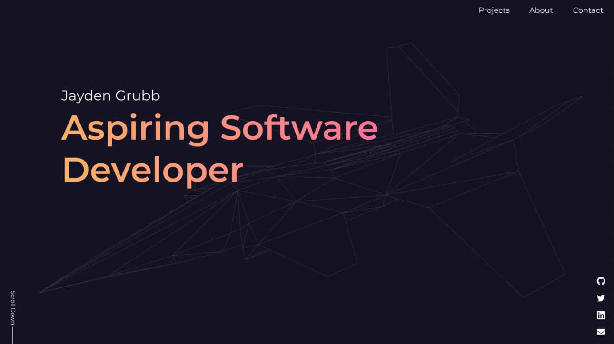
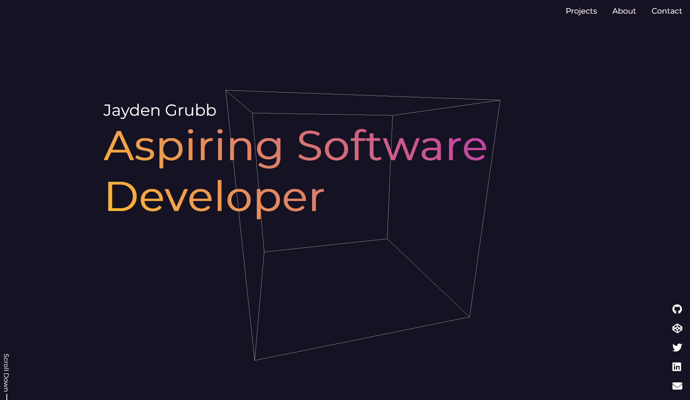

# jaydengrubb
## About
My personal homepage to be displayed at [jaydengrubb.com](https://www.jaydengrubb.com).

`main` branch contains the current live version of the website (currently only "Under Development..." message).  
`dev-1` branch contains discarded experimental version containing some useful code.  
`dev-2` branch contains current work-in-progress version.
## Tech

| Name | Description/Use |
| --- | --- |
| HTML | Just regular HTML, used to define page elements |
| JavaScript | Again, just regular JavaScript, mostly used to trigger animations as well as below |
| [Sass](https://sass-lang.com/) | CSS with superpowers |
| [Three.js](https://threejs.org/) | JavaScript library used to render 3D models and animations in the browser |
| [Firebase](https://firebase.google.com/) | Provides hosting and analytics as well as basic CI/CD when used with GitHub |

## Images
  

  

  

*\* note aliasing of 3d model is less apparent in live version when animated*
## License
[BSD-3-Clause License](LICENSE)